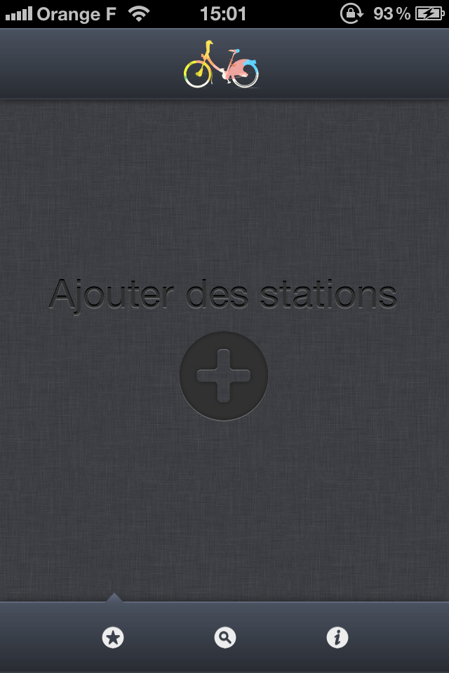
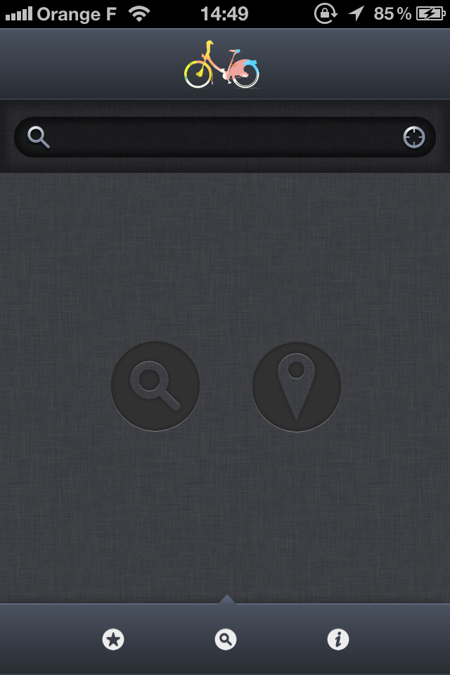
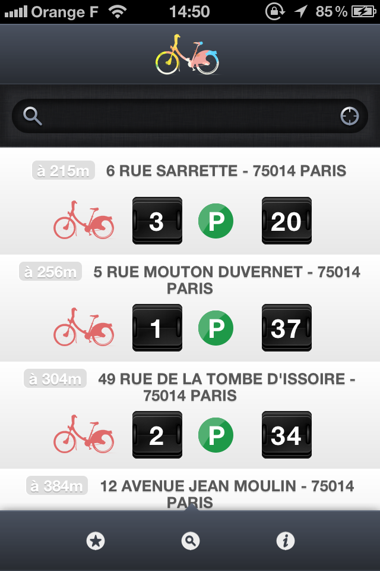
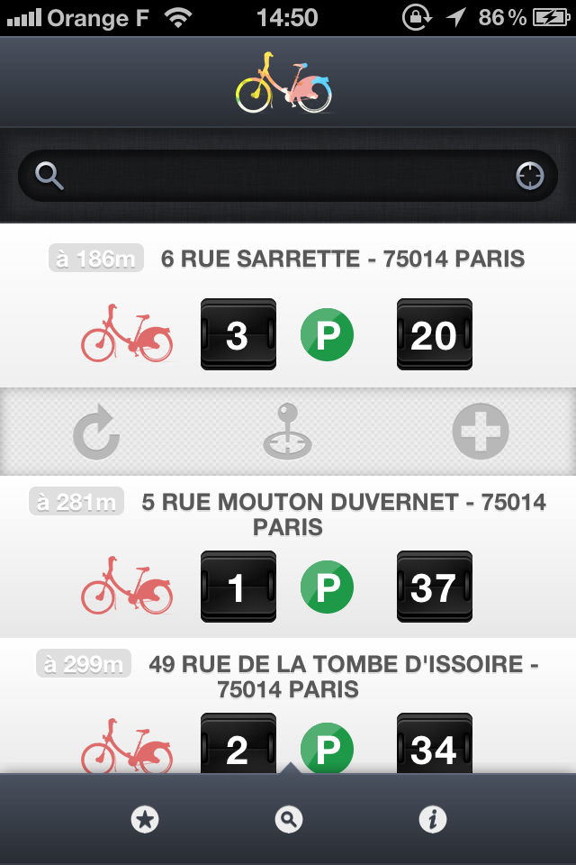
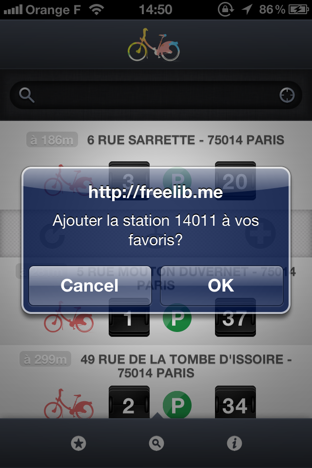
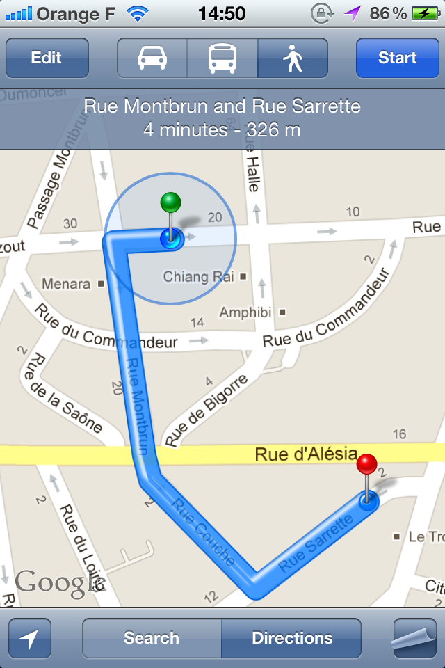

# FreeLib'

FreeLib' is a free service developed by <a href="http://fourvinger.com/">Fourvinger</a> and it's not affiliated to the official Velib' service proposed by la Mairie de Paris and JC Decaux. 

## Screenshots

